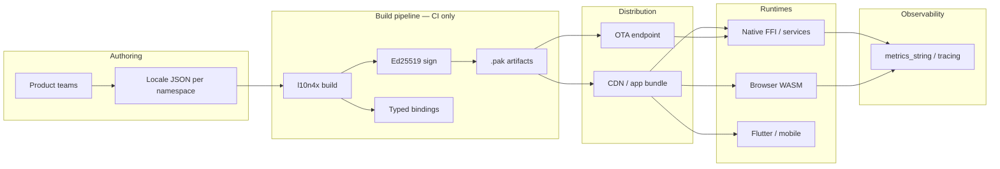

# Enterprise Adoption Guide

How to deploy l10n4x in organizations that need **governance**, **auditability**, and **scale** — governed releases, team-scoped namespaces, and audit-friendly pipelines without sacrificing runtime performance.

l10n4x is a **compiled localization platform**: translations are validated, signed, and versioned artifacts consumed by a minimal runtime across native, WASM, and FFI targets. Runtime JSON parsing is not the primary model.

---

## Design principles (enterprise alignment)

| Principle | Enterprise pattern | l10n4x implementation |
|-----------|-------------------|----------------------|
| **Separation of concerns** | Translators work in TMS; engineering owns source structure | JSON source → `l10n4x build` → signed `.pak`; runtime never parses JSON |
| **Compile-time safety** | Build fails on missing or inconsistent keys | `validate`, typed codegen (`generated.ts`, Go structs, etc.), `debug-keys` for staging |
| **Namespace ownership** | One bounded context per team or domain | Modular bundles: `{locale}/{namespace}.pak` + `namespaces.json` manifest |
| **Release governance** | Signed artifacts, versioned promotions, rollback path | Ed25519-signed artifacts, format v2 + `min_runtime_version`, OTA reload + rollback |
| **Operational visibility** | Central monitoring and release audit trail | v2 metrics (`cache_hit_ratio`, `miss_by_locale`, OTA counters), optional `tracing` |
| **Polyglot footprint** | Single message repository, many runtimes | Core `no_std` + FFI + WASM; bindings for Go, TS/React, C#, Flutter, Python |

---

## Reference architecture



### Role boundaries

| Role | Owns | Does not touch |
|------|------|----------------|
| **Engineering** | Source JSON structure, key naming, ICU templates, `l10n4x.config.json` | Signing seed in client binaries |
| **Localization** | Translated JSON per locale/namespace | Runtime code, `.pak` signing |
| **Platform / SRE** | CI signing keys, CDN/OTA delivery, metrics dashboards | Translation content |
| **Security** | Key rotation policy, `verifyPublicKey` distribution, optional `L10E` encryption | Day-to-day string edits |

---

## Project layout (modular enterprise)

Assign **one namespace per bounded context** (team, product area, or compliance domain):

```
locales/
  en/
    common.json      →  dist/en/common.pak
    auth.json        →  dist/en/auth.pak
    billing.json     →  dist/en/billing.pak
  es/
    common.json
    auth.json
    billing.json
dist/
  namespaces.json    →  manifest: preload order, ownership metadata
  generated.ts       →  thin key hashes only (web)
```

Enable in `l10n4x.config.json`:

```json
{
  "bundles": { "mode": "modular" },
  "fallback": "en"
}
```

Runtime loads namespaces on demand; missing namespaces fall through the fallback chain without crashing readers.

---

## CI/CD contract

### Build stage (mandatory gates)

1. **`l10n4x validate`** — key parity across locales; use `--report-misses` in staging (requires `debug-keys` build).
2. **`l10n4x build`** — emit signed `.pak` files and language bindings.
3. **Artifact attestation** — store pak SHA-256 + signature metadata alongside release notes (supply-chain audit).

### Secrets (never in client repos)

| Secret | Where | Purpose |
|--------|-------|---------|
| `L10N4X_SIGNING_KEY` | CI secret manager only | Ed25519 seed — signs all `.pak` files |
| `L10N4X_ENCRYPT_KEY` | CI + server-side inject (if `encrypt: true`) | AES-GCM envelope — optional confidentiality |

The runtime receives only the **public** `verifyPublicKey` (64 hex chars). Signing capability never ships in `l10n4x-core`, `l10n4c`, or WASM.

### Promotion flow

```
dev branch  →  validate + build (debug-keys)  →  staging CDN
release tag →  validate + build (release)      →  production CDN / OTA
hotfix      →  OTA reload signed pak           →  rollback if metrics spike
```

---

## Runtime integration by platform

| Platform | Package / binding | Load model |
|----------|-------------------|------------|
| **Web (React)** | [`l10n4x-js`](https://github.com/xdvi/l10n4x-js): `@l10n4x/react`, `@l10n4x/runtime` | WASM + fetch/fs loaders; `L10nProvider` + `useTranslation` |
| **Web (Vue)** | `@l10n4x/vue` | `createL10nPlugin()` + `useTranslation()` |
| **Web (Svelte)** | `@l10n4x/svelte` | `createL10nStores()` |
| **Web (Angular)** | `@l10n4x/angular` | `provideL10n()`, `I18nService`, `I18nPipe` |
| **Web (SSR)** | `@l10n4x/runtime` with `fsPakLoader` | Node reads `.pak` from disk at request time |
| **Native services** | `l10n4c` FFI | `l10n4c_load_pak`, `l10n4c_load_namespace`, thread-safe RCU reads |
| **Mobile** | Flutter/Dart generated bindings | Asset bundle or OTA download |
| **Polyglot backend** | Go / Python / C# examples | Shared `libl10n4c` + generated wrappers |

Web apps should depend on **`@l10n4x/*`** packages (published from `l10n4x-js`), not embed runtime logic in CLI-generated files. The CLI emits a thin `generated.ts` with key hashes and types only.

---

## OTA updates and rollback

For services that cannot wait for an app store release:

1. Download signed `.pak` from a trusted endpoint.
2. Verify Ed25519 signature (automatic in `try_ota_reload_pak`).
3. Atomic `swap_store` — readers never block.
4. Retain one retired snapshot per locale for `try_ota_rollback`.

Monitor:

- `pak_reload_total` — successful hot swaps
- `pak_verify_failures` — rejected tampered or incompatible artifacts
- `pak_rollback_total` — manual or automated rollbacks

Reject incompatible format with `RuntimeTooOld` (error code 13) rather than panicking — explicit compatibility gates for mixed deployments.

Scoped OTA (`l10n4c_store_ota_reload_pak` / `try_ota_reload_pak_for_store`) isolates hot reloads per tenant store — one tenant's webhook cannot swap another tenant's paks.

---

## Multi-tenant translations (Go / Rust server)

Use **one scoped store per tenant** for pak isolation; pass **locale per request** from session/JWT (unchanged `translate(locale, …)` signature).

### Rust (`l10n4x-core`)

1. **On tenant provision:** `create_store()` → load tenant paks via `try_load_pak_locale_for_store` / `try_load_static_bytes_for_store`
2. **Per HTTP request:** `translate_for_store(Some(handle), user.locale, key_hash, …)`
3. **OTA webhook (tenant-scoped):** `try_ota_reload_pak_for_store(Some(handle), locale, bytes)`
4. **Teardown:** `destroy_store(handle)` when tenant offboards
5. **Never** call global `clear_translations()` in multi-tenant mode — it wipes the process-global store

### Go / C (`l10n4c` FFI)

1. **On tenant provision:** `h := l10n4c_store_create()` → `l10n4c_store_load_pak_locale(h, locale, path)`
2. **Per HTTP request:** `l10n4c_store_translate(h, user.Locale, key_hash, buf, max_len)` — locale from session/JWT
3. **OTA webhook:** `l10n4c_store_ota_reload_pak(h, locale, bytes, len)`
4. **Teardown:** `l10n4c_store_destroy(h)`
5. Keep a `map[tenantID]uint32` (or Rust-side registry) — do not use global `l10n4c_clear()` in multi-tenant mode

Global `T()` / `l10n4c_translate()` remain valid for single-tenant or shared-base deployments.

---

## Observability checklist

| Signal | Source | Action |
|--------|--------|--------|
| `cache_hit_ratio` | `metrics_string` v2 | Tune hot keys / preload namespaces |
| `miss_by_locale` | per-locale miss counts | Incomplete translation rollout |
| `format_errors` | ICU bytecode failures | Fix source templates before release |
| `pak_verify_failures` | OTA / load path | Block CDN node, rotate keys if needed |
| `tracing` (feature) | structured spans on load/translate | SRE dashboards |

Set CI bench regression threshold at 5% on `translate` hot path — performance is part of the enterprise SLA.

---

## Security posture summary

See [THREAT_MODEL.md](./THREAT_MODEL.md) for full detail. Enterprise summary:

- **Integrity**: mandatory Ed25519 on every `.pak` (tamper detection in transit and at rest).
- **Confidentiality**: optional `L10E` AES-GCM for unreleased strings — not a substitute for client-side secrecy.
- **Compatibility**: `format_version` + `min_runtime_version` gate unsafe mixed deployments.
- **Concurrency**: RCU readers + serialized writers — safe under multi-threaded services without external locks on reads.

---

## Adoption phases

| Phase | Scope | Exit criteria |
|-------|-------|---------------|
| **1 — Pilot** | Single locale, monolith `.pak`, one binding target | `validate` + `build` in CI; smoke tests green |
| **2 — Modular** | Namespaces per team; fallback chain | `namespaces.json` manifest; per-team ownership in CODEOWNERS |
| **3 — OTA** | Hot reload for web/native services | Rollback tested; `pak_*` metrics in dashboard |
| **4 — TMS** (P2.1) | Crowdin / Lokalise / Phrase sync | Translators never edit `.pak` directly |

---

## Anti-patterns (do not do this)

| Anti-pattern | Why it fails enterprise bar |
|--------------|----------------------------|
| Runtime JSON fetch + parse | No signature, no compile-time validation, unbounded latency |
| Unsigned `.pak` in production | Supply-chain gap — equivalent to skipping code signing |
| Single giant locale file for 50 teams | Merge conflicts, memory bloat, no ownership boundaries |
| Embedding signing seed in app | Violates architecture separation; full compromise on leak |
| Skipping `validate` in CI | Missing keys discovered in production (or by users) |

---

## TMS handoff

Use `l10n4x sync` to exchange locale JSON with translation teams and push signed paks to a webhook. See [TMS.md](./TMS.md).

## Related documents

- [TMS.md](./TMS.md) — export/import and webhook push
- [ARCHITECTURE.md](./ARCHITECTURE.md) — package layout and data flow
- [PAK_FORMAT.md](./PAK_FORMAT.md) — binary format and versioning
- [THREAT_MODEL.md](./THREAT_MODEL.md) — security assumptions
- [ROADMAP.md](./ROADMAP.md) — P2 backlog (TMS, ICU MF2, multi-tenant)
- [l10n4x-js](https://github.com/xdvi/l10n4x-js) — official web runtime (`@l10n4x/react`)