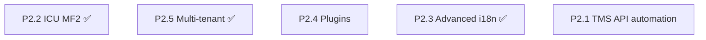

# l10n4x Roadmap

Prioritized plan to improve **scalability**, **maintainability**, and **robustness** for enterprise deployments — compile-time validation, signed artifacts, namespace ownership, and polyglot runtimes.

l10n4x is built for enterprise scale: governed releases, team-scoped namespaces, and audit-friendly pipelines — with sub-microsecond runtime lookups and mandatory artifact signing.

For adoption patterns (CI/CD, roles, OTA, observability), see [ENTERPRISE_ADOPTION.md](./ENTERPRISE_ADOPTION.md).

---

## Already shipped

### Baseline (pre-0.1.0)

- Sub-microsecond lookup hot path (`translate_to_writer`, offset maps, TLS caches)
- `Option<Arc>` for empty `lazy_cache` / `offset_maps` (cheap `swap_store` on empty stores)
- Dual TLS cache in `translate()` (fast path for labels, full cache for params/context)
- Mandatory Ed25519 signing, optional AES-GCM envelope (`L10E`)
- Context suffixes (`friend_male`), fallback chains, locale-change callbacks
- ICU-lite bytecode formatter (opcodes `0x01`–`0x0C`), CLDR plural rules (120+ locales)
- Multi-target codegen (Go, TypeScript, Python, C, Flutter); web bindings in [l10n4x-js](https://github.com/xdvi/l10n4x-js)
- Dev server with hot reload, `validate` / `extract` CLI commands
- Core + FFI benchmarks, basic fuzz targets (`lookup`, `decompress_pak`)

### P0 — Production blockers ✅ (v0.1.0)

| Item | Summary |
|------|---------|
| **P0.1** Thread-safe reload | Writers serialized; readers lock-free RCU |
| **P0.2** Modular bundles | `{locale}/{namespace}.pak` + `namespaces.json`; `load_namespace` / `init_modular` |
| **P0.3** Debug keys | `debug-keys` feature + `validate --report-misses` |
| **P0.4** Pak versioning | L10N v2, `min_runtime_version`, `RuntimeTooOld` error |

### P1 — High ROI ✅ (v0.1.0)

| Item | Summary |
|------|---------|
| **P1.1** OTA updates | `try_ota_reload_pak` / `try_ota_rollback` + FFI + metrics |
| **P1.2** COW locales | Per-entry `Arc<StoreData>` via `upsert_locale` / `remove_locale` |
| **P1.3** Hot-path parity | Shared `hash_params`; FFI/WASM TLS cache alignment |
| **P1.4** Observability | v2 `metrics_string`, optional `tracing`, CI bench regression (5%) |
| **P1.5** Test hardening | wasmtime smoke, interval plural E2E, FFI locale test, dev server backoff |
| **P1.6** Web runtime | [`l10n4x-js`](https://github.com/xdvi/l10n4x-js): `@l10n4x/react`, `@l10n4x/runtime`, `examples/vite-spa` |

---

## P2 — Strategic (active backlog)

### P2.1 — TMS integration ✅ (v0.1.0)

| Deliverable | Status |
|-------------|--------|
| `l10n4x-tms.json` export/import | ✅ `l10n4x sync --provider file` |
| Crowdin-compatible tree export/import | ✅ `--provider crowdin` |
| Post-build webhook push | ✅ `--provider webhook`, `tms.pushOnBuild` |
| Crowdin/Lokalise API automation | Backlog (`l10n4x-plugin-crowdin`; offline tree export/import ✅) |

See [TMS.md](./TMS.md).

---

### P2.6 — JS runtime bridge ✅ (v0.1.0 + l10n4x-js)

| Deliverable | Status |
|-------------|--------|
| WASM `load_namespace` + OTA exports | ✅ |
| `@l10n4x/runtime` modular + OTA | ✅ |
| CI + npm publish pipeline | ✅ [l10n4x-js](https://github.com/xdvi/l10n4x-js) |

---

### P2.2 — ICU MessageFormat 2 parity

- ✅ Interval plurals — native range bytecode (`0x07`), no expansion cap
- ✅ MF2 complex messages — `.input`, `.local`, `{{patterns}}`, `.match`, literals, markup
- ✅ List-format JSON — full escape decoding (`\n`, `\uXXXX`, Unicode)
- ✅ ICU conformance harness — `syntax.json` 114/114; `syntax-errors.json` 100%; `data-model-errors.json` 100%; compile-time `validate_data_model`
- ✅ Full MF2 runtime formatting parity — opcode `0x0E` (`Mf2Match`), `:test:*` functions, `pattern-selection.json` 22/22

---

### P2.3 — Advanced i18n ✅

- Timezone-aware datetime via reserved `tz` param (`format_date_tz`, IANA subset + fixed offsets)
- Explicit RTL / bidi isolates in formatter (`bidi::format_segment`)
- Locale data pinning: L10N v3 header `locale_data_version` (`LOCALE_DATA_VERSION`)

---

### P2.4 — Plugin system

- `L10nPlugin` trait: `post_process`, `missing_key`, `load_backend`
- Runtime registration (Rust) and CLI generator hooks
- Community extensions without core forks

---

### P2.5 — Multi-tenant / per-user locale ✅

- `StoreHandle` registry — isolated load/translate/clear/OTA per handle
- FFI `l10n4c_store_*` for Go/C server bindings (handle `0` reserved / invalid)
- Scoped OTA reload and rollback per store (retired snapshots keyed by `(store_id, locale)`)
- TLS translate cache keyed by `(store_id, locale, key)` — no cross-tenant cache bleed
- Global APIs unchanged (`translate()`, `l10n4c_translate()`, `l10n4c_load_pak_locale()`)
- Go typed `Store` wrapper in generated `i18n.go` (`NewStore`, `Close`, scoped `T`)
- **Deferred (P2.5.1):** overlay stores (tenant inherits base paks); WASM multi-store

---

## Recommended execution order

| Sprint | Focus |
|--------|-------|
| **Next** | P2.4 Plugins or P2.1 Crowdin API automation |
| **Backlog** | P2.5.1 overlay stores, WASM multi-store |

---

## Success metrics

| Phase | Done when |
|-------|-----------|
| **P0** ✅ | 8 concurrent readers + 1 reloader: no crash, consistent output; staging misses show human keys |
| **P1** ✅ | OTA pak swap with zero read downtime; WASM bench within ~10% of FFI; CI fails on >5% bench regression |
| **P2** | Translation team syncs via TMS; per-tenant scoped stores for SaaS backends; React/native apps use modular OTA without FFI-only APIs |

---

## Non-goals (for now)

- Ad-hoc runtime JSON as the primary format (conflicts with signed bytecode model)
- Replicating lightweight client-only i18n plugin ecosystems
- Full ICU C API compatibility layer

---

## Related documents

- [ENTERPRISE_ADOPTION.md](./ENTERPRISE_ADOPTION.md) — governance, CI/CD, roles, OTA
- [ARCHITECTURE.md](./ARCHITECTURE.md) — data flow and package layout
- [PAK_FORMAT.md](./PAK_FORMAT.md) — binary format specification
- [THREAT_MODEL.md](./THREAT_MODEL.md) — security assumptions
- [l10n4x-js](https://github.com/xdvi/l10n4x-js) — official JavaScript / React packages