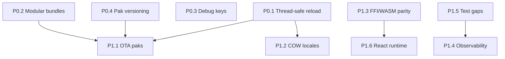

# l10n4x Roadmap

Prioritized plan to improve **scalability**, **maintainability**, and **robustness** — informed by the current `main` branch (post performance work) and comparison with ecosystem tools such as i18next.

l10n4x and i18next solve different problems:

| Dimension | l10n4x | i18next |
|-----------|--------|---------|
| Performance | Sub-µs lookups, precompiled bytecode | JSON resolution at runtime |
| Security | Signed `.pak` artifacts (Ed25519), optional encryption | Plain JSON resources |
| Targets | `no_std`, native FFI, WASM, multi-language bindings | JavaScript-first |
| Errors | Compile-time validation, typed bindings | Often runtime-only discovery |

This roadmap does **not** aim to clone i18next. It strengthens l10n4x where it is already differentiated (compiled runtime, security, native performance) while closing gaps in **operability**, **developer experience**, and **organizational scale**.

---

## Already shipped (baseline)

Do not re-implement these; build on them.

- Sub-microsecond lookup hot path (`translate_to_writer`, offset maps, TLS caches)
- `Option<Arc>` for empty `lazy_cache` / `offset_maps` (cheap `swap_store` on empty stores)
- Dual TLS cache in `translate()` (fast path for labels, full cache for params/context)
- Mandatory Ed25519 signing, optional AES-GCM envelope (`L10E`)
- Context suffixes (`friend_male`), fallback chains, locale-change callbacks
- ICU-lite bytecode formatter (opcodes `0x01`–`0x0C`), CLDR plural rules (120+ locales)
- Multi-target codegen (Go, TypeScript, Python, C, Flutter, Vue, Svelte, Angular)
- Dev server with hot reload, `validate` / `extract` CLI commands
- Core + FFI benchmarks, basic fuzz targets (`lookup`, `decompress_pak`)

---

## P0 — Production blockers

Required before confident multi-threaded / multi-tenant production use.

### P0.1 — Thread-safe reload (`load` / `clear`)

**Problem:** Load and clear operations are not thread-safe; callers must serialize them externally. Concurrent readers + writers risk torn state.

**Deliverables:**

- Atomic publish of new store snapshots for `load_raw_bytes`, `load_pak_*`, and `clear_translations` under the same RCU model used for reads
- Documented contract: readers never block; writers publish immutable snapshots
- Stress tests extending `test_lock_free_concurrency_rcu` (N readers + 1 reloader, no panics, consistent lookups)

**Primary files:** `packages/core/src/store.rs`, `packages/core/src/loader.rs`, `packages/core/tests/integration_tests.rs`

---

### P0.2 — Modular bundles (namespace scale)

**Problem:** One `.pak` per locale does not scale for large apps (memory, deploy size, team ownership).

**Deliverables:**

- Official convention: per-namespace artifacts (e.g. `en/auth.pak`, `en/billing.pak`)
- Runtime API: `load_namespace(locale, namespace)` with optional unload
- CLI: `build` emits namespace paks plus a manifest (`namespaces.json`)
- Fallback policy: missing namespace skips gracefully (no crash); keys fall through fallback chain

**Primary files:** `packages/compiler/`, `packages/core/src/loader.rs`, `packages/cli/src/main.rs`, `docs/ARCHITECTURE.md`

---

### P0.3 — Debug mode: hash → human key

**Problem:** Runtime uses `u64` key hashes; misses return hex strings. Hard to debug vs string-key systems like i18next.

**Deliverables:**

- Optional dev-only embedded table (`key_hash → "common.welcome"`)
- Compile-time feature `debug-keys` (zero cost in release builds)
- CLI `validate --report-misses` with human-readable keys and source file hints

**Primary files:** `packages/compiler/src/binary_writer.rs`, `packages/core/src/store.rs`, `packages/cli/`

---

### P0.4 — `.pak` versioning and compatibility

**Problem:** No explicit format/runtime compatibility policy blocks safe OTA updates and rollbacks.

**Deliverables:**

- Header fields: `format_version`, `min_runtime_version`
- Runtime rejects incompatible paks with typed errors (no panic)
- Documented breaking-change policy in `CHANGELOG.md` and `docs/PAK_FORMAT.md`

**Primary files:** `packages/core/src/binary_format.rs`, `packages/compiler/`, `docs/PAK_FORMAT.md`

---

## P1 — High ROI (3–6 months)

Improves operability and adoption without rewriting the lookup engine.

### P1.1 — OTA translation updates

**Deliverables:**

- Protocol: download signed `.pak` → verify → atomic `swap_store`
- Rollback to previous pak (retain one retired snapshot)
- Metrics: `pak_reload_total`, `pak_verify_failures`, `pak_rollback_total`

**Depends on:** P0.1, P0.4

---

### P1.2 — Fine-grained COW for `locales`

**Problem:** `Arc::make_mut` on the locales `Vec` clones the entire vector when readers hold the `Arc`, even if only one locale entry changes.

**Deliverables:**

- Structural sharing per locale entry (`im::Vector`, or `Arc` per `(locale, StoreData)` pair)
- `load_raw_bytes_reload` benchmark stable under concurrent readers
- Complements existing `Option<Arc>` optimization for `offset_maps` / `lazy_cache`

**Primary files:** `packages/core/src/store.rs`, `packages/core/src/loader.rs`

---

### P1.3 — Unify hot path: core / FFI / WASM

**Problem:** Three divergent translation paths (core TLS cache, FFI TLS + `Arc<str>`, WASM calling `translate()` with extra allocations).

**Deliverables:**

- Shared `hash_params` in core (FFI consumes it, remove duplication)
- WASM: TLS cache + `translate_to_writer` where applicable
- FFI: check thread-local cache before `hash_params` on parametric hits

**Primary files:** `packages/core/src/store.rs`, `packages/ffi/src/lib.rs`, `packages/wasm/src/lib.rs`

---

### P1.4 — Production observability

**Deliverables:**

- Exportable metrics: `translate_total`, `cache_hit_ratio`, `miss_by_locale`, `format_errors`
- Optional `tracing` integration (feature-gated)
- CI bench regression: criterion baseline comparison, fail PR if hot path regresses >5%

**Primary files:** `packages/core/src/metrics.rs`, `.github/workflows/`, `packages/core/benches/`, `packages/ffi/benches/`

---

### P1.5 — Close test gaps (see `REPORT.md`)

| Gap | Action |
|-----|--------|
| WASM bindings | CI test with `wasmtime` (not only Rust signature checks) |
| Interval plurals | End-to-end `compile_translations` → `translate` |
| `l10n4c_get_loaded_locales` | Dedicated FFI integration test |
| Dev server flaky test | Deterministic port binding or retry policy |

---

### P1.6 — Official web runtime libraries

**Problem:** Code generators exist for TypeScript/Vue/Svelte, but there is no first-class runtime like `react-i18next`.

**Deliverables:**

- Minimal `@l10n4x/react`: `useTranslation` hook, locale-change subscription
- End-to-end example in `examples/typescript`
- Migration guide: i18next → l10n4x feature parity table

---

## P2 — Strategic (ecosystem & ICU parity)

Large investment; valuable once native/game/SaaS adoption is established.

### P2.1 — TMS integration (Crowdin / Lokalise / Phrase)

- Export/import compiler JSON format
- Post-build webhook to upload signed paks
- CLI: `l10n4x sync --provider <name>`

---

### P2.2 — ICU MessageFormat 2 parity

- Full MF2 parser/compiler (beyond opcodes `0x01`–`0x0C`)
- Interval plurals without 100-entry cap
- Robust list-format JSON parsing (escapes, Unicode)
- ICU conformance test suite

---

### P2.3 — Advanced i18n

- Timezone-aware datetime (versioned CLDR locale data)
- Explicit RTL / bidi handling in formatter
- Locale data pinning per app release

---

### P2.4 — Plugin system (i18next-style)

- `L10nPlugin` trait: `post_process`, `missing_key`, `load_backend`
- Runtime registration (Rust) and CLI generator hooks
- Community extensions without core forks

---

### P2.5 — Multi-tenant / per-user locale

- Session-scoped locale override without mutating global store
- Scoped `TranslationStore` (not only global RCU pointer)
- SaaS user-preference use case

---

## Recommended execution order

| Sprint | Focus |
|--------|-------|
| **Sprint 1** | P0.1 + P0.3 + P0.4 (safe reload, debuggability, format contract) |
| **Sprint 2** | P0.2 + P1.2 (organizational scale, concurrent reload perf) |
| **Sprint 3** | P1.1 + P1.4 + P1.5 (OTA, observability, test hardening) |
| **Sprint 4** | P1.3 + P1.6 (binding parity, web adoption) |
| **Backlog** | P2.x driven by user demand (TMS, full ICU, plugins) |

---

## Success metrics

| Phase | Done when |
|-------|-----------|
| **P0** | 8 concurrent readers + 1 reloader: no crash, consistent output; staging misses show human keys |
| **P1** | OTA pak swap in <50 ms with zero read downtime; WASM bench within ~10% of FFI; CI fails on >5% bench regression |
| **P2** | Translation team syncs via TMS; React app migrates from i18next in <1 day using official guide |

---

## Non-goals (for now)

- Replicating i18next's entire npm plugin ecosystem
- Runtime JSON parsing as the primary format (conflicts with signed bytecode model)
- Full ICU C API compatibility layer

---

## Related documents

- [ARCHITECTURE.md](./ARCHITECTURE.md) — data flow and package layout
- [PAK_FORMAT.md](./PAK_FORMAT.md) — binary format specification
- [THREAT_MODEL.md](./THREAT_MODEL.md) — security assumptions
- [REPORT.md](../REPORT.md) — V3 implementation status and known gaps