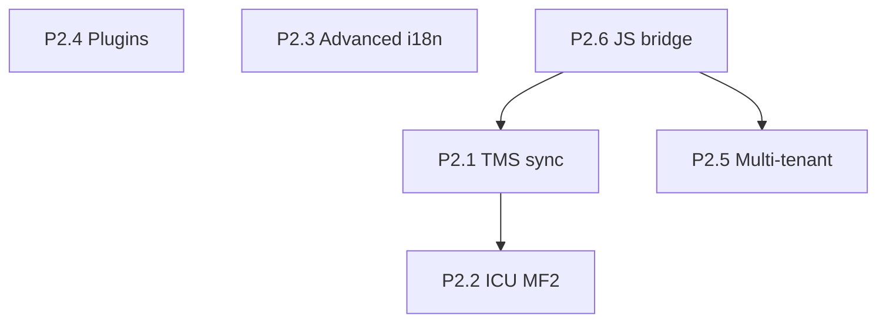

# l10n4x Roadmap

Prioritized plan to improve **scalability**, **maintainability**, and **robustness** for enterprise deployments — compile-time validation, signed artifacts, namespace ownership, and polyglot runtimes.

l10n4x targets the same organizational problems as **Angular's compile-time i18n** and **SAP's centralized message management**: governed releases, team-scoped namespaces, and audit-friendly pipelines — with sub-microsecond runtime lookups and mandatory artifact signing.

For adoption patterns (CI/CD, roles, OTA, observability), see [ENTERPRISE_ADOPTION.md](./ENTERPRISE_ADOPTION.md).

---

## Already shipped

### Baseline (pre-0.3.0)

- Sub-microsecond lookup hot path (`translate_to_writer`, offset maps, TLS caches)
- `Option<Arc>` for empty `lazy_cache` / `offset_maps` (cheap `swap_store` on empty stores)
- Dual TLS cache in `translate()` (fast path for labels, full cache for params/context)
- Mandatory Ed25519 signing, optional AES-GCM envelope (`L10E`)
- Context suffixes (`friend_male`), fallback chains, locale-change callbacks
- ICU-lite bytecode formatter (opcodes `0x01`–`0x0C`), CLDR plural rules (120+ locales)
- Multi-target codegen (Go, TypeScript, Python, C, Flutter, Vue, Svelte, Angular)
- Dev server with hot reload, `validate` / `extract` CLI commands
- Core + FFI benchmarks, basic fuzz targets (`lookup`, `decompress_pak`)

### P0 — Production blockers ✅ (v0.3.0)

| Item | Summary |
|------|---------|
| **P0.1** Thread-safe reload | Writers serialized; readers lock-free RCU |
| **P0.2** Modular bundles | `{locale}/{namespace}.pak` + `namespaces.json`; `load_namespace` / `init_modular` |
| **P0.3** Debug keys | `debug-keys` feature + `validate --report-misses` |
| **P0.4** Pak versioning | L10N v2, `min_runtime_version`, `RuntimeTooOld` error |

### P1 — High ROI ✅ (v0.3.0)

| Item | Summary |
|------|---------|
| **P1.1** OTA updates | `try_ota_reload_pak` / `try_ota_rollback` + FFI + metrics |
| **P1.2** COW locales | Per-entry `Arc<StoreData>` via `upsert_locale` / `remove_locale` |
| **P1.3** Hot-path parity | Shared `hash_params`; FFI/WASM TLS cache alignment |
| **P1.4** Observability | v2 `metrics_string`, optional `tracing`, CI bench regression (5%) |
| **P1.5** Test hardening | wasmtime smoke, interval plural E2E, FFI locale test, dev server backoff |
| **P1.6** Web runtime | [`l10n4x-js`](https://github.com/xdvi/l10n4x-js): `@l10n4x/react`, `@l10n4x/runtime`, `examples/vite-spa` |

---

## P2 — Strategic (active backlog)

Large investment; valuable once native/game/SaaS adoption is established. Prioritize by customer demand.

### P2.1 — TMS integration (Crowdin / Lokalise / Phrase)

- Export/import compiler JSON format
- Post-build webhook to upload signed paks
- CLI: `l10n4x sync --provider <name>`

---

### P2.2 — ICU MessageFormat 2 parity

- Full MF2 parser/compiler (beyond opcodes `0x01`–`0x0C`)
- Interval plurals without 100-entry cap
- Robust list-format JSON parsing (escapes, Unicode)
- ICU conformance test suite

---

### P2.3 — Advanced i18n

- Timezone-aware datetime (versioned CLDR locale data)
- Explicit RTL / bidi handling in formatter
- Locale data pinning per app release

---

### P2.4 — Plugin system

- `L10nPlugin` trait: `post_process`, `missing_key`, `load_backend`
- Runtime registration (Rust) and CLI generator hooks
- Community extensions without core forks

---

### P2.5 — Multi-tenant / per-user locale

- Session-scoped locale override without mutating global store
- Scoped `TranslationStore` (not only global RCU pointer)
- SaaS user-preference use case

---

### P2.6 — JS runtime bridge (l10n4x-js)

Close gaps between Rust core features and the web packages:

- WASM exports for `load_namespace` and OTA (`l10n4x_ota_*`)
- Wire `bundles.modular` in `@l10n4x/runtime` engine
- CI + npm publish pipeline for `@l10n4x/*`

---

## Recommended execution order

| Sprint | Focus |
|--------|-------|
| **Next** | P2.6 JS bridge (WASM parity for modular + OTA) |
| **Then** | P2.1 TMS — unlocks enterprise translation workflows |
| **Backlog** | P2.2 ICU, P2.5 multi-tenant, P2.3/P2.4 by demand |

---

## Success metrics

| Phase | Done when |
|-------|-----------|
| **P0** ✅ | 8 concurrent readers + 1 reloader: no crash, consistent output; staging misses show human keys |
| **P1** ✅ | OTA pak swap with zero read downtime; WASM bench within ~10% of FFI; CI fails on >5% bench regression |
| **P2** | Translation team syncs via TMS; scoped locale overrides for SaaS; React/native apps use modular OTA without FFI-only APIs |

---

## Non-goals (for now)

- Ad-hoc runtime JSON as the primary format (conflicts with signed bytecode model)
- Replicating lightweight client-only i18n plugin ecosystems
- Full ICU C API compatibility layer

---

## Related documents

- [ENTERPRISE_ADOPTION.md](./ENTERPRISE_ADOPTION.md) — governance, CI/CD, roles, OTA
- [ARCHITECTURE.md](./ARCHITECTURE.md) — data flow and package layout
- [PAK_FORMAT.md](./PAK_FORMAT.md) — binary format specification
- [THREAT_MODEL.md](./THREAT_MODEL.md) — security assumptions
- [l10n4x-js](https://github.com/xdvi/l10n4x-js) — official JavaScript / React packages